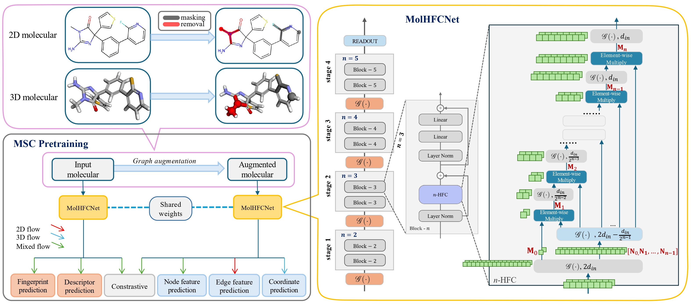

# MolHFCNet: Enhancing Molecular Graph Representations with Hierarchical Feature Combining and Hybrid Pretraining (IJCAI 2025)

This repository contains the official implementation of **"MolHFCNet: Enhancing Molecular Graph Representations with Hierarchical Feature Combining and Hybrid Pretraining"**, published in *IJCAI 2025*.



Efficient molecular property prediction is crucial in bioinformatics and cheminformatics, with applications in drug discovery, materials science, and chemical engineering. This paper introduces MolHFCNet, a graph neural network designed to enhance molecular representation learning. At its core, the n-Hierarchical Features Combining (n-HFC) module aggregates information across multiple hierarchical feature spaces, effectively capturing both local and global graph structures. Unlike conventional models, n-HFC maintains computational complexity comparable to a single full-dimensional graph layer while supporting either 2D or 3D molecular graphs, ensuring flexibility across tasks. Furthermore, we propose a novel graph pretraining strategy that integrates predictive and contrastive learning, enabling the model to capture local chemical interactions and global molecular contexts for robust embeddings. Experimental results on benchmark datasets demonstrate MolHFCNet’s superior accuracy and efficiency compared to state-of-the-art methods, highlighting the potential of high-order hierarchical feature learning for advancing molecular graph analysis.

## Requirements

- **Python 3.8.5**
- Install required dependencies:

   ```bash
   pip install -r requirements.txt -f https://data.pyg.org/whl/torch-2.0.0+cu118.html

   ```

---

## Pretrained Models

The pretrained **MolHFCNet-CFC** and **MolHFCNet-GTN** models used in this framework are hosted on HuggingFace:

- Download them from [ndlong/MolHFCNet](https://huggingface.co/ndlong/MolHFCNet/tree/main).

Clone the model weights into the `ckpt` folder:
```bash
git clone https://huggingface.co/ndlong/MolHFCNet ckpt
```

---

## Dataset

We tested our framework on:
- **MoleculeNet Datasets** for molecular property prediction.
- **Atom3D Datasets** for binding affinity prediction.

For access to MoleculeNet Datasets, please contact **[Prof. Binh Nguyen](mailto:binh.p.nguyen@vuw.ac.nz)** or **[me](nguyenlong3@myvuw.ac.nz)**. With Atom3D Datasets, we followed the setting of **[GeoSSL](https://github.com/chao1224/GeoSSL)**.

---

## Usage

To reproduce results from the paper, configure hyperparameters in `training.py` and run the training script:

```bash
## Start training
python training.py
```

---

## Acknowledgements

This repository builds upon the following projects:
- [MM-DTI](https://github.com/ndlongvn/MM-DTI)
- [HorNet](https://github.com/raoyongming/HorNet)

We are grateful to the contributors of these projects for their valuable work!

---

## Citation

Our paper proceeding will come soon.

<!-- If you find this work useful in your research, please cite:

```bibtex
@article{doi:10.1021/acs.jcim.4c01240,
  author = {Nguyen, Long D. and Nguyen, Quang H. and Trinh, Quang H. and Nguyen, Binh P.},
  title = {From SMILES to Enhanced Molecular Property Prediction: A Unified Multimodal Framework with Predicted 3D Conformers and Contrastive Learning Techniques},
  journal = {Journal of Chemical Information and Modeling},
  doi = {10.1021/acs.jcim.4c01240},
  note ={PMID: 39641280},
  URL = {https://doi.org/10.1021/acs.jcim.4c01240}
}
``` -->
